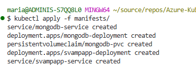

# Azure-Kubernetes

## Inledning

Jag har valt att skapa en applikation för svampentusiaster. Syftet med projektet är i sin enkelhet att implementera ett Kubernetes-kluster.

Jag valde att skapa klustret i **Azure**, eftersom jag personligen föredrar den plattformen framför **AWS**.

Eftersom det inte fanns någon komplett instruktion att följa, fick jag i vissa delar söka vägledning via **LLM** (Large Language Model) för att hitta lämpliga lösningar.

Projektets olika moment har genomförts i den ordning som presenteras nedan.;


<table><thead><tr><th>Steg</th><th>Lärarens moment</th><th width="212.7777099609375">Min motsvarighet (Azure)</th><th>Vad jag gör</th></tr></thead><tbody><tr><td>1</td><td>MongoDB Todo App Development</td><td>Utveckla Svampsidan lokalt</td><td>Bygg app, testa CRUD, containerisera med Docker Compose</td></tr><tr><td>2</td><td>Inbakat i deploy (AWS)</td><td>Push till ACR</td><td>Bygg och pusha image till Azure Container Registry</td></tr><tr><td>3</td><td>AWS EKS / Kubernetes GKE</td><td>Skapa AKS-kluster</td><td>Provisionera Kubernetes-kluster i Azure</td></tr><tr><td>4</td><td>Kubernetes EKS</td><td>Skapa Kubernetes Manifests</td><td>Skriv YAML-filer (deployment, service, secret, etc.)</td></tr><tr><td>5</td><td>Deploy Todo App / Kustomize</td><td>Deploya till AKS</td><td>Använd kubectl apply för manuell deploy</td></tr><tr><td>6</td><td>Ingress</td><td>Installera Nginx Ingress</td><td>Exponera appen externt via ingress.yaml</td></tr><tr><td>7</td><td>ArgoCD</td><td>Aktivera GitOps med ArgoCD</td><td>Installera ArgoCD, anslut repo, automatisk synk</td></tr></tbody></table>

#### **DEL 1: Lokal utveckling(MongoDB Todo App Development)**

**Applikationsbeskrivning**

En fullständig CRUD-applikation för att hantera svampar, med:

* **Backend:** ASP.NET Core 8.0 med Minimal API
* **Frontend:** Vanilla JavaScript (HTML/CSS/JS)
* **Databas:** MongoDB
* **Admin UI:** Mongo Express
* **Containerisering:** Docker Compose

***

**Filstruktur**

```
svamp-app/webapp/Svampsidan/
├── Dockerfile
├── Svampsidan.csproj
├── Program.cs
└── wwwroot/
    ├── docker-compose.yml
    ├── init-mongo.js
    ├── index.html
    └── crud.html
```


#### **Funktionalitet**

✅ Visa lista med svampar\
✅ Lägga till ny svamp\
✅ Bocka i som "hittad"\
✅ Uppdatera namn\
✅ Ta bort svamp\
✅ Data sparas i MongoDB och överlever omstarter

#### **Åtkomst**

* **Svampapp:** [http://localhost:8080](http://localhost:8080)
* **CRUD-sidan:** [http://localhost:8080/crud.html](http://localhost:8080/crud.html)
* **Mongo Express:** [http://localhost:8081](http://localhost:8081) (admin/pass)

#### **Frontend-struktur**

Frontenden består av två separata HTML-filer:

**1. `index.html` - Startsida**

* Enkel välkomstsida med information om appen
* Länk till CRUD-funktionaliteten

**2. `crud.html` - CRUD-funktionalitet**

* Hantera alla svampoperationer (Create, Read, Update, Delete)
* Visa lista med alla svampar
* Lägga till nya svampar
* Markera svampar som "hittade"
* Ta bort svampar

**Fördelar med denna separation:**

* ✅ Tydlig separation mellan presentation och funktionalitet
* ✅ Bättre användarupplevelse med dedikerad arbetssida
* ✅ Enklare att underhålla och vidareutveckla

#### **DEL 2: PUSH TILL ACR** \*¹&#x20;

**Varför ACR?** Min Docker image finns just nu endast lokalt på datorn. AKS (Azure Kubernetes Service) kan inte komma åt min lokala dator, därför behöver imagen finnas i molnet. ACR (Azure Container Registry) fungerar som ett molnbaserat bildbibliotek där Kubernetes kan hämta imagen.

#### **Flöde:**

```
Lokal dator (Docker image) 
    ↓ PUSH
ACR (Lagring i Azure) 
    ↓ PULL
AKS (Kubernetes kör appen)
```

#### **Steg som utfördes:**

1. **Skapade Resource Group:**

```bash
   az group create --name mysvampsidaRG --location westeurope
```

2. **Skapade ACR:**

```bash
   az acr create --resource-group mysvampsidaRG --name svampapp --sku Basic
```

3. **Loggade in i ACR:**

```bash
   az acr login --name svampapp
```

4. **Tagga imagen för ACR**

```bash
   docker tag svampapp-web:latest svampapp.azurecr.io/svampapp:v1
```

5. **Pusha till ACR**

```bash
docker push svampapp.azurecr.io/svampapp:v1
```

<figure><figcaption></figcaption></figure>

**Resultat:** Docker imagen finns nu i `svampapp.azurecr.io/svampapp:v1` och kan användas av AKS.


### Del 3: Skapa AKS Kluster

Jag började att manuellt sätta upp detta i portalen men insåg snabbt att det skulle ta tid, speciellt då jag inte var helt 100 på vad jag behövde fylla i.&#x20;

Så jag gick över till CLI istället för att skapa ett kluster

```bash
az aks create \
  --resource-group mysvampsidaRG \
  --name myAKSCluster \
  --node-count 1 \
  --generate-ssh-keys \
  --attach-acr svampapp
```

#### **Vad gör vi**&#x20;

* Skapar ett Kubernetes-kluster med **1 node** (server)
* Aktiverar monitoring (så jag ser vad som händer)
* Genererar SSH-nycklar automatiskt
* **Kopplar ACR** (så AKS kan hämta min image!)

#### **Reslutat**

```
AAD role propagation done[############################################]  100.0000%{
  "aadProfile": null,
  "addonProfiles": null,
  "agentPoolProfiles": [
    {
      "availabilityZones": null,
      "capacityReservationGroupId": null,
      "count": 1,
      "creationData": null,
      "currentOrchestratorVersion": "1.32.7",
      "eTag": null,
      "enableAutoScaling": false,
      "enableEncryptionAtHost": false,
      "enableFips": false,
      "enableNodePublicIp": false,
      "enableUltraSsd": false,
      "gpuInstanceProfile": null,
      "hostGroupId": null,
      "kubeletConfig": null,
      "kubeletDiskType": "OS",
      "linuxOsConfig": null,
      "maxCount": null,
      "maxPods": 250,
      "minCount": null,
      "mode": "System",
      "name": "nodepool1",
      "networkProfile": null,
      "nodeImageVersion": "AKSUbuntu-2204gen2containerd-202510.19.1",
      "nodeLabels": null,
      "nodePublicIpPrefixId": null,
      "nodeTaints": null,
      "orchestratorVersion": "1.32",
      "osDiskSizeGb": 128,
      "osDiskType": "Managed",
      "osSku": "Ubuntu",
      "osType": "Linux",
      "podSubnetId": null,
      "powerState": {
        "code": "Running"
      },
      "provisioningState": "Succeeded",
      "proximityPlacementGroupId": null,
      "scaleDownMode": "Delete",
      "scaleSetEvictionPolicy": null,
      "scaleSetPriority": null,
      "securityProfile": {
        "enableSecureBoot": false,
        "enableVtpm": false
      },
      "spotMaxPrice": null,
      "tags": null,
      "type": "VirtualMachineScaleSets",
      "upgradeSettings": {
        "drainTimeoutInMinutes": null,
        "maxSurge": "10%",
        "nodeSoakDurationInMinutes": null
      },
      "vmSize": "Standard_DS2_v2",
      "vnetSubnetId": null,
      "windowsProfile": null,
      "workloadRuntime": null
    }
  ],
  "apiServerAccessProfile": null,
  "autoScalerProfile": null,
  "autoUpgradeProfile": {
    "nodeOsUpgradeChannel": "NodeImage",
    "upgradeChannel": null
  },
  "azureMonitorProfile": null,
  "azurePortalFqdn": "myaksclust-mysvampsidarg-456993-l4eikpy1.portal.hcp.westeurope.azmk8s.io",
  "currentKubernetesVersion": "1.32.7",
  "disableLocalAccounts": false,
  "diskEncryptionSetId": null,
  "dnsPrefix": "myAKSClust-mysvampsidaRG-456993",
  "eTag": null,
  "enablePodSecurityPolicy": null,
  "enableRbac": true,
  "extendedLocation": null,
  "fqdn": "myaksclust-mysvampsidarg-456993-l4eikpy1.hcp.westeurope.azmk8s.io",
  "fqdnSubdomain": null,
  "httpProxyConfig": null,
  "id": "/subscriptions/456993d6-92bf-47d7-9310-25a1e3381be4/resourcegroups/mysvampsidaRG/providers/Microsoft.ContainerService/managedClusters/myAKSCluster",
  "identity": {
    "delegatedResources": null,
    "principalId": "3da407d4-97f9-4722-bd2e-b8249b4b34f1",
    "tenantId": "67f216cd-693d-4de9-8fc8-17089f128b95",
    "type": "SystemAssigned",
    "userAssignedIdentities": null
  },
  "identityProfile": {
    "kubeletidentity": {
      "clientId": "11d492d2-c7e3-4a10-9e3b-6a12eccda374",
      "objectId": "a1ae273d-02a6-49e3-b106-168bc3a8a037",
      "resourceId": "/subscriptions/456993d6-92bf-47d7-9310-25a1e3381be4/resourcegroups/MC_mysvampsidaRG_myAKSCluster_westeurope/providers/Microsoft.ManagedIdentity/userAssignedIdentities/myAKSCluster-agentpool"
    }
  },
  "ingressProfile": null,
  "kubernetesVersion": "1.32",
  "linuxProfile": {
    "adminUsername": "azureuser",
    "ssh": {
      "publicKeys": [
        {
          "keyData": "ssh-rsa AAAAB3NzaC1yc2EAAAADAQABAAACAQDv4A/2WKIFXYcmQAGmu+zmZ/4hZ2LkLdJSUGbGgH0AUopID4sWL8vFbWWqKOV1f2G0agQRJ3XdUOFAvFGFCDyA/R46La2BqbSftXQg9zoFokCm5hWviP2aV5kLmwgzQm5YpjH4wNpKrDmsFSun2INhS2klLEg8clnkRQgzO4WHZahubd0ytGczX//u4Y0DvYJgLbByWf2rReJSGaExLsJadEHtMADGbuU3zM6h2sDCMeWABXRgVmIuL7NE/FQhxdQ4VXFGwBC9/Kv0HsHw/Qq1AzkWAxmWt4iamIp4hKlB8VUbRaUUos5gVbknM9ddcgGgtc4RR17sM1enakHCOGoMUO7DAl8Locqh2xShKuAqtEOGe9sbFD1vFQpa6xsoipGf8UjTUQ5Qqc06OhcPPb96PuQpER8W6GMUg+zVI92Vz2ZhkLj1uXBSD2tXoDqsA06ItKZYHeD8uAqfsL/0DoTuHq3Q7IfoxRZNnNW4e7/5mVgREGH/t8jRuXBoX/dPOnjHhCtHEWlJyhxbFJEP1TOXrk5tbxAyIXfeCEHKW/rsgUTZwCHTsNQheZy/UNmEjiw6aphT+yxKTJpMxJzotzE0WMqftL4zy1/hLihlQNXqXG5tGxF/6BEQVkBC75k4j31kaFiCxiUCIo+mVSP21h9qutl0cOjcfut5iI3mF+tM0Q== mariaschillstrom@hotmail.com\n"
        }
      ]
    }
  },
  "location": "westeurope",
  "maxAgentPools": 100,
  "metricsProfile": {
    "costAnalysis": {
      "enabled": false
    }
  },
  "name": "myAKSCluster",
  "networkProfile": {
    "advancedNetworking": null,
    "dnsServiceIp": "10.0.0.10",
    "ipFamilies": [
      "IPv4"
    ],
    "loadBalancerProfile": {
      "allocatedOutboundPorts": null,
      "backendPoolType": "nodeIPConfiguration",
      "effectiveOutboundIPs": [
        {
          "id": "/subscriptions/456993d6-92bf-47d7-9310-25a1e3381be4/resourceGroups/MC_mysvampsidaRG_myAKSCluster_westeurope/providers/Microsoft.Network/publicIPAddresses/d2bbfb89-1048-473e-9b84-76dcf315e5dc",
          "resourceGroup": "MC_mysvampsidaRG_myAKSCluster_westeurope"
        }
      ],
      "enableMultipleStandardLoadBalancers": null,
      "idleTimeoutInMinutes": null,
      "managedOutboundIPs": {
        "count": 1,
        "countIpv6": null
      },
      "outboundIPs": null,
      "outboundIpPrefixes": null
    },
    "loadBalancerSku": "standard",
    "natGatewayProfile": null,
    "networkDataplane": "azure",
    "networkMode": null,
    "networkPlugin": "azure",
    "networkPluginMode": "overlay",
    "networkPolicy": "none",
    "outboundType": "loadBalancer",
    "podCidr": "10.244.0.0/16",
    "podCidrs": [
      "10.244.0.0/16"
    ],
    "serviceCidr": "10.0.0.0/16",
    "serviceCidrs": [
      "10.0.0.0/16"
    ]
  },
  "nodeResourceGroup": "MC_mysvampsidaRG_myAKSCluster_westeurope",
  "nodeResourceGroupProfile": null,
  "oidcIssuerProfile": {
    "enabled": false,
    "issuerUrl": null
  },
  "podIdentityProfile": null,
  "powerState": {
    "code": "Running"
  },
  "privateFqdn": null,
  "privateLinkResources": null,
  "provisioningState": "Succeeded",
  "publicNetworkAccess": null,
  "resourceGroup": "mysvampsidaRG",
  "resourceUid": "691499fdc4fb3d0001da5271",
  "securityProfile": {
    "azureKeyVaultKms": null,
    "defender": null,
    "imageCleaner": null,
    "workloadIdentity": null
  },
  "serviceMeshProfile": null,
  "servicePrincipalProfile": {
    "clientId": "msi",
    "secret": null
  },
  "sku": {
    "name": "Base",
    "tier": "Free"
  },
  "storageProfile": {
    "blobCsiDriver": null,
    "diskCsiDriver": {
      "enabled": true
    },
    "fileCsiDriver": {
      "enabled": true
    },
    "snapshotController": {
      "enabled": true
    }
  },
  "supportPlan": "KubernetesOfficial",
  "systemData": null,
  "tags": null,
  "type": "Microsoft.ContainerService/ManagedClusters",
  "upgradeSettings": null,
  "windowsProfile": null,
  "workloadAutoScalerProfile": {
    "keda": null,
    "verticalPodAutoscaler": null
  }
}
```

### Ansluta till AKS med kubectl

#### **Varfär;**&#x20;

* [x] Starta appar
* [x] Se vad som körs&#x20;
* [x] Stoppa/starta saker
* [x] Felsäk

#### **Kör**

```
az aks get-credentials --resource-group mysvampsidaRG --name myAKSCluster
```

#### Verifiera

```
kubectl get nodes
```

#### Resultat&#x20;

```
NAME                                STATUS   ROLES    AGE   VERSION
aks-nodepool1-14013471-vmss000000   Ready    <none>   26m   v1.32.7
```


### **Slutgiltiga filer**

**Program.cs**

csharp

```csharp
using Microsoft.AspNetCore.Mvc;
using MongoDB.Bson;
using MongoDB.Bson.Serialization.Attributes;
using MongoDB.Driver;

var builder = WebApplication.CreateBuilder(args);

// Configure JSON serialization
builder.Services.ConfigureHttpJsonOptions(options =>
{
    options.SerializerOptions.PropertyNamingPolicy = System.Text.Json.JsonNamingPolicy.CamelCase;
});

// Add MongoDB client
var mongoHost = Environment.GetEnvironmentVariable("MONGODB_HOST") ?? "localhost";
var mongoPort = Environment.GetEnvironmentVariable("MONGODB_PORT") ?? "27017";
var mongoDatabase = Environment.GetEnvironmentVariable("MONGODB_DATABASE") ?? "SvampappDb";

var connectionString = $"mongodb://{mongoHost}:{mongoPort}";
builder.Services.AddSingleton<IMongoClient>(new MongoClient(connectionString));
builder.Services.AddScoped(sp =>
{
    var client = sp.GetRequiredService<IMongoClient>();
    return client.GetDatabase(mongoDatabase);
});

var app = builder.Build();

// Serve static files
app.UseDefaultFiles();
app.UseStaticFiles();

// API Endpoints
app.MapGet("/api/svampar", async (IMongoDatabase db) =>
{
    var collection = db.GetCollection<Svamp>("Svampar");
    var svampar = await collection.Find(_ => true).ToListAsync();
    return Results.Ok(svampar);
});

app.MapGet("/api/svampar/{id}", async (int id, IMongoDatabase db) =>
{
    var collection = db.GetCollection<Svamp>("Svampar");
    var svamp = await collection.Find(s => s.Id == id).FirstOrDefaultAsync();
    return svamp is not null ? Results.Ok(svamp) : Results.NotFound();
});

app.MapPost("/api/svampar", async (Svamp svamp, IMongoDatabase db) =>
{
    var collection = db.GetCollection<Svamp>("Svampar");
    await collection.InsertOneAsync(svamp);
    return Results.Created($"/api/svampar/{svamp.Id}", svamp);
});

app.MapPut("/api/svampar/{id}", async (int id, Svamp updatedSvamp, IMongoDatabase db) =>
{
    var collection = db.GetCollection<Svamp>("Svampar");
    var existing = await collection.Find(s => s.Id == id).FirstOrDefaultAsync();
    if (existing == null) return Results.NotFound();

    updatedSvamp.Id = id;
    updatedSvamp._id = existing._id;
    var result = await collection.ReplaceOneAsync(s => s.Id == id, updatedSvamp);
    return result.ModifiedCount > 0 ? Results.Ok(updatedSvamp) : Results.NotFound();
});

app.MapDelete("/api/svampar/{id}", async (int id, IMongoDatabase db) =>
{
    var collection = db.GetCollection<Svamp>("Svampar");
    var result = await collection.DeleteOneAsync(s => s.Id == id);
    return result.DeletedCount > 0 ? Results.Ok() : Results.NotFound();
});

app.Run();

public class Svamp
{
    [BsonId]
    public ObjectId _id { get; set; }
    public int Id { get; set; }
    public string Name { get; set; } = string.Empty;
    public bool IsComplete { get; set; }
}
```

**docker-compose.yml**

yaml

```yaml
services:
  mongodb:
    image: mongo:latest
    container_name: svamp-mongodb
    ports:
      - "27017:27017"
    volumes:
      - mongodb-data:/data/db
      - ./init-mongo.js:/docker-entrypoint-initdb.d/init-mongo.js:ro
    networks:
      - svampapp-network
    healthcheck:
      test: echo 'db.runCommand("ping").ok' | mongosh localhost:27017/test --quiet
      interval: 10s
      timeout: 5s
      retries: 5

  mongo-express:
    image: mongo-express:latest
    container_name: svamp-mongo-express
    ports:
      - "8081:8081"
    environment:
      ME_CONFIG_MONGODB_URL: mongodb://mongodb:27017
      ME_CONFIG_BASICAUTH_USERNAME: admin
      ME_CONFIG_BASICAUTH_PASSWORD: pass
    networks:
      - svampapp-network
    depends_on:
      mongodb:
        condition: service_healthy

  webapp:
    build:
      context: ./webapp/Svampsidan
      dockerfile: Dockerfile
    container_name: svampapp-webapp
    ports:
      - "8080:8080"
    environment:
      MONGODB_HOST: mongodb
      MONGODB_PORT: "27017"
      MONGODB_DATABASE: SvampappDb
    networks:
      - svampapp-network
    depends_on:
      mongodb:
        condition: service_healthy

volumes:
  mongodb-data:

networks:
  svampapp-network:
    driver: bridge
```

**init-mongo.js**

javascript

```javascript
db = db.getSiblingDB('SvampappDb');

db.Svampar.insertMany([
    {
        "Id": 1,
        "Name": "Kantarell",
        "IsComplete": false
    },
    {
        "Id": 2,
        "Name": "Karljohan",
        "IsComplete": true
    }
]);

print("Database initialized with sample svampar!");
```

***


***


### Problem & lösningar

#### **ACR** \*¹

När jag försökte bygga och pusha min Docker image direkt i Azure med kommandot:

bash

````bash
az acr build --registry svampapp --image svampapp:v1 .
```

Fick jag felet:
```
(TasksOperationsNotAllowed) ACR Tasks requests for the registry svampapp 
are not permitted.
````

#### **Orsak:**

Azure for Students-subscriptionen har **begränsningar** som blockerar ACR Tasks (Azure's tjänst för att bygga Docker images i molnet).

#### **Lösning:**&#x20;

Istället för att låta Azure bygga imagen byggde jag den **lokalt** och pushade sedan den färdiga imagen till ACR:

**Se punkt 2**


### Referenser

**Websidor**









**LLM**

* [https://claude.ai/login?returnTo=%2F%3F](https://claude.ai/login?returnTo=%2F%3F)
* [https://chatgpt.com/](https://chatgpt.com/)


